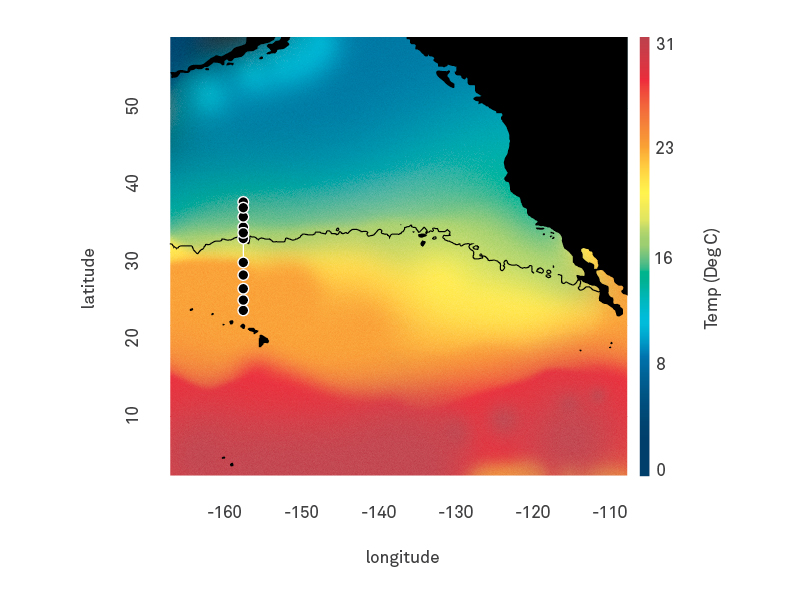
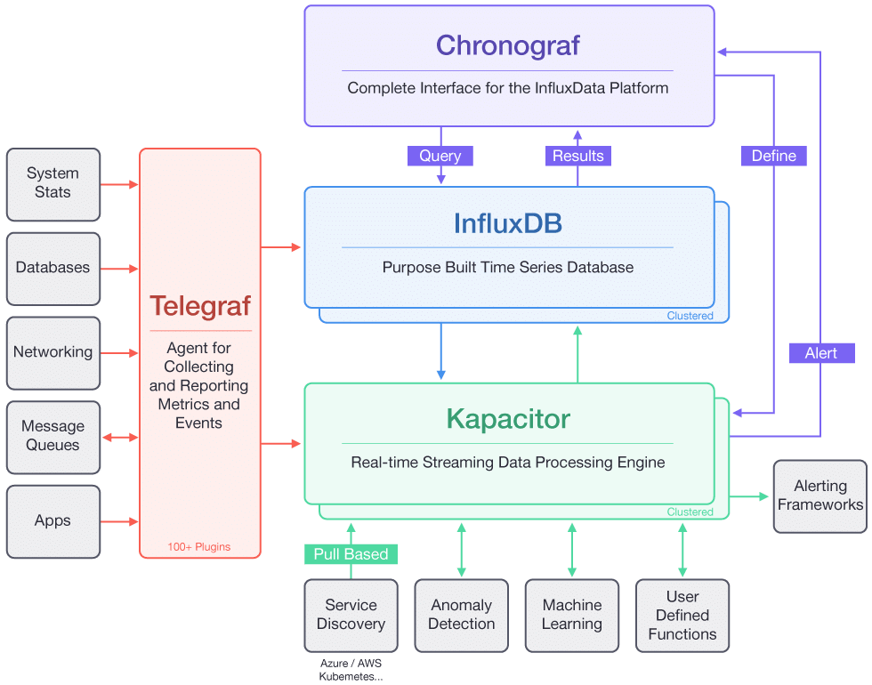

<!-- $theme: gaia -->
<!-- template: gaia -->
<!-- $size: 4:3 -->
## Integrated Analysis of Data from Automated Instruments

#### A case study in repurposing modern "DevOps" tools for real-time science
 

###### Vaughn Iverson¹ ², Chris Berthiaume¹, Francois Ribalet¹, Ginger Armbrust¹

University of Washington
<small>
¹ School of Oceanography
² eScience Institute
</small>

---
<!-- page_number: true -->
# A bit about me...

---
# ...and our lab

---
# SeaFlow: *"A census for the very small"*
##### 

 

---
## Realtime Integrated Monitoring

[http://armbrustlab.github.io/seaflowviz3](http://armbrustlab.github.io/seaflowviz3)

---
# Gradients Cruise

---
# Gradients Cruise

#### Now with 
## MOAR 
#### automated
#### instruments!

---
# Gradients 2.0

Integrate all the things!
**IT** will be Great!  Build **IT**!

---
# Gradients 2.0

==Integrate all the things!
**IT** will be Great!  Build **IT**!==

*Uh, what is "IT" exactly, again?*

---
# Gradients 2.0

==Integrate all the things!
**IT** will be Great!  Build **IT**!==

==*Uh, what is "IT" exactly, again?*==

Oh, you know, that great thing you did for SeaFlow...
... but with **MOAR** Instruments!
Shouldn't be too hard, right? When will **IT** be done?

---
# Gradients 2.0

==Integrate all the things!
**IT** will be Great!  Build **IT**!==

==*Uh, what is "IT" exactly, again?*==

==Oh, you know, that great thing you did for SeaFlow...
... but with **MOAR** Instruments!
Shouldn't be too hard, right? When will **IT** be done?==

*Um... No. That's not how this works.* 
*We're going to need agree on the requirements first.*

---
# Gradients 2.0

==Integrate all the things!
**IT** will be Great!  Build **IT**!==

==*Uh, what is "IT" exactly, again?*==

==Oh, you know, that great thing you did for SeaFlow...
... but with **MOAR** Instruments!
Shouldn't be too hard, right? When will **IT** be done?==

==*Um... No. That's not how this works.* 
*We're going to need agree on the requirements first.*==

Huh? How do we do that?

---
### Gradients 2.0 Requirements Summarized:
* Capture as much data as possible, as it's generated
    * From both instruments and experiental results 
* Enable simple, realtime interactive plotting
    * Customizable on the fly by scientists
* Tolerate certain hardware and network failures
    * Within defined limits  
* Same capabilities available on ship and shore
    * But, lower resolution data on shore 

---
# DevOps

---
# DevOps

---
# DevOps

---
# SciOps? *(not PsyOps!)*

### Or perhaps: *ResearchOps*

---
# Monitoring tools

Popular "stacks" of OSS monitoring tools:
* "**ELK**": **E**lasticsearch, **L**ogstash, **K**ibana
* "**TICK**": **T**elegraf, **I**nfluxDB, **C**hronograf, **K**apacitor

Also popular: Promethius, Grafana 

---
# What are all of these things?

<small>influxdata.com</small>

---

##### Architecture

---

# Consul / Nomad

---

# Minio

---

# Restic

---

# Custom Upload

---

# InfluxDB

---

# Grafana

---

# Lessons / Takeaways

## Time

## Rsync

## Maps

---

# Conclusion

