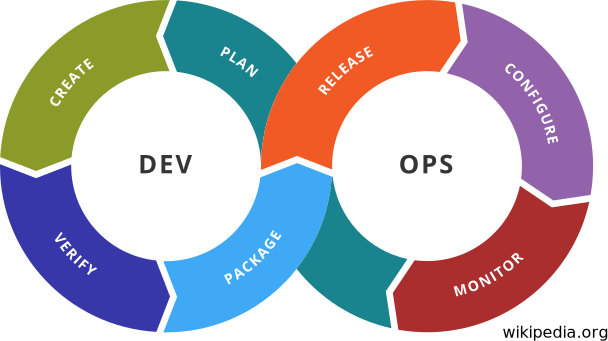

<!-- $theme: gaia -->
<!-- template: gaia -->
<!-- $size: 4:3 -->
## Integrated Analysis of Data from Automated Instruments

#### A case study in repurposing modern "DevOps" tools for real-time science
 

###### Vaughn Iverson¹ ², Chris Berthiaume¹, Francois Ribalet¹, Ginger Armbrust¹

University of Washington
<small>
¹ School of Oceanography
² eScience Institute
</small>

---
<!-- page_number: true -->
# A bit about me...

---
# ...and our lab

---
# SeaFlow: *"A census for the very small"*
##### 

 

---
# DevOps

---
# DevOps

---
# DevOps

---
# Monitoring tools

Popular "stacks" of OSS monitoring tools:
* "**ELK**": **E**lasticsearch, **L**ogstash, **K**ibana
* "**TICK**": **T**elegraf, **I**nfluxDB, **C**hronograf, **K**apacitor

Popular alternatives: Promethius, Grafana 

---
# SciOps? *(not PsyOps!)*

### Or perhaps: *ResearchOps*

---
# SeaFlow

---

# Initial Seaflow Website

## Gradients

---

# Gradients 2.0

## Moar instruments!

---

# Integrate all the things!

## Requirements

---

# So we needed to bring a cluster...

---

# Architecture

---

# Consul / Nomad

---

# Minio

---

# Restic

---

# Custom Upload

---

# InfluxDB

---

# Grafana

---

# Lessons / Takeaways

## Time

## Rsync

## Maps

---

# Conclusion

